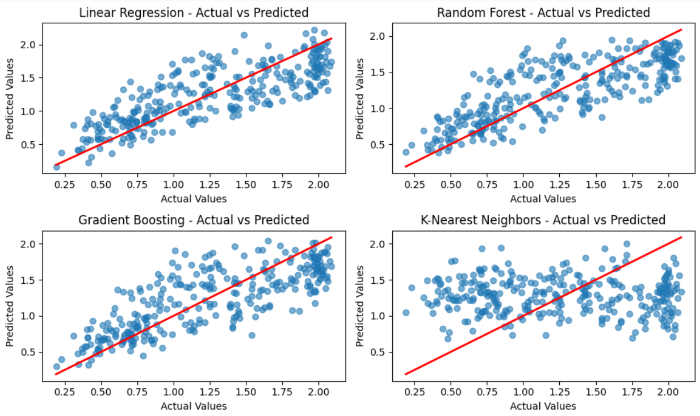

# Fuel Cell Performance Prediction

## Project Overview:
This project is focused on predicting fuel cell performance using a dataset containing multiple features. The objective is to apply various machine learning regression models to predict fuel cell performance based on a set of features.

The dataset is divided into different targets based on roll numbers, and multiple machine learning models are used to predict the values for each target.

## Dataset:
The dataset used in this project is Fuel_cell_performance_data-Full.csv, which contains various columns and multiple targets. The dataset includes information related to fuel cell performance and is used to predict one of five target columns:

- **Target1**: Roll numbers ending with 0 or 5
- **Target2**: Roll numbers ending with 1 or 6
- **Target3**: Roll numbers ending with 2 or 7
- **Target4**: Roll numbers ending with 3 or 8
- **Target5**: Roll numbers ending with 4 or 9

## Target Selection:
For each model, one of the targets (Target1, Target2, Target3, Target4, Target5) is selected based on the roll number condition provided. The process involves:

1. Selecting a target based on roll numbers.
2. Dropping other target columns.
3. Splitting the dataset into training and testing sets with a 70/30 ratio.

## Machine Learning Models
Multiple regression models are trained and evaluated to predict the selected target. The models used in this project are:

- **Linear Regression**
- **Random Forest Regressor**
- **Gradient Boosting Regressor**
- **K-Nearest Neighbors Regressor**

## Evaluation Metrics
Each model is evaluated using the following metrics:

- **Mean Squared Error (MSE)**: Measures the average squared difference between actual and predicted values.
- **R-Squared (R2)**: Indicates the proportion of the variance in the target that is predictable from the features.

## Dependencies
To run the code, you will need the following Python libraries:

- pandas
- scikit-learn
- matplotlib
- google-colab (for file upload in Colab)

## Results
The performance of each model is evaluated and visualized by plotting the actual vs predicted values. The results are printed in the console for each model, including MSE and R2.

